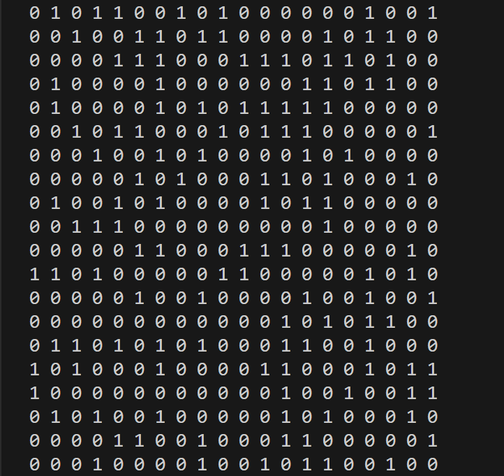

# lab2 迷宫

## 地图

迷宫地图在maze.txt文件中，其中
- 0/1分别表示通道/障碍
- 迷宫入口为矩阵左上角
- 迷宫出口为矩阵右下角
如下图所示🔢：
- 此地图有解🔢：

## 机器人
- 起点在迷宫入口： `push(stack, (Position){0, 0});  visited[0][0] = true;`
- 只有四个移动方向:`Position directions[4] = {{-1, 0}, {0, 1}, {1, 0}, {0, -1}};`
 

## 栈
- 使用顺序存储的栈结构，`typedef struct {
    Position* data;
    int top;
    int capacity;
} Stack;`

## 任务：
1. 理解现有代码
2. **尽量**不修改现有函数
3. 把机器人算出来的路径（并不是机器人走过的路径）用字符“.”显示出来
4. 使用所学的数据结构，找到<ins>**最短**</ins>的路径，用“.”显示该路径，并计算<ins>**输出**</ins>路径长度。